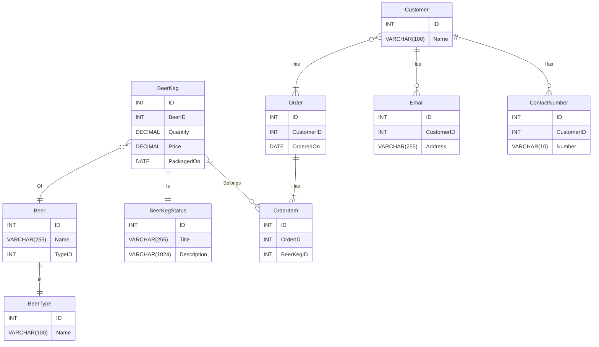
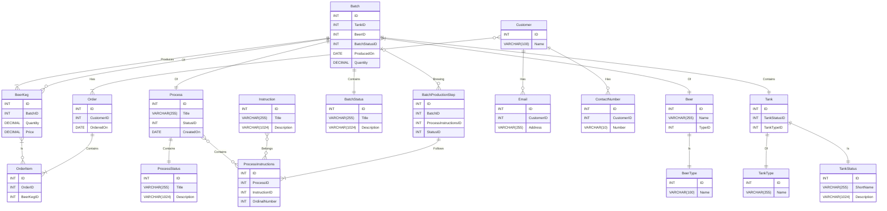

# crafdb

A db for a small scale brewery, that sells craft beer.

#[TOC]

## Diagram

### MVP

### Production WIP

## Tables

## BeerType
Contains the type of beers that can be brewed .e.g Ale, Lager, Stout, Pilsner etc

### Relationships
- One BeerType describes many Beer

## Beer
Functions more like a beer brand table, contains the type and name of beer

### Assumptions
- The company can brew many types of beer for the same brand e.g. Castle Lager and Castle Milk Stout

### Relationships
- One Beer is brewed in zero to many Batches
- One Beer Is of one BeerType

## Tank
Represents the containment units at the brewing facility. Used to contain batches of beer

### Assumptions
- All Tanks are of the same capacity
- Tanks can be flagged (Associated with a specific status) as contaminate, decomissioned, available, used etc
- There are different kinds of tanks, tanks used for storing contaminated batches and those used in the brewing process

### Relationships
- One Tank is of one TankType
- One Tank is flagged for one TankStatus

## TankType
Represents the types of tanks serving different purposes

### Relationships
- One TankType is associated with zero or many Tanks

## TankStatus
Represents the flags that can be placed on a tank

### Relationships
- One TankStatus can be flagged on zero to many Tanks

## BatchStatus
Represents the flags that can be placed on a batch of beer

### Relationships
- One status can be flagged on zero to many Batches

## Batch 
Represents the tangible instance of a Beer entity, the product that's manufactured and sold.

### Assumptions
- A Batch can be flagged (Associated with a specific status) as complete, contaminated etc
- When a batch is flagged as contaminated it is moved to a storage tank
- Batches are of uniform quantity (Fill the tank to capacity)
- The Batch entity also represents the product sold, to elaborate, batches can't be broken down they are sold as is. 

### Relationships
- One Batch is of one Beer
- One Batch is kept in one Tank
- One Batch is flagged with one BatchStatus
- Zero to many Batches are brewed according to zero or many recipes

## Instruction
Represents a single procedure that is part of manufacturing

### Assumptions
- An instruction isn't just a procedure in the brewing process but a procedure in the the entire production process, such as packaging, disposing of contaminated batches etc

### Relationships
- One to Many Instructions are part of Zero to Many Recipes; Hence
- One Instruction is part of zero to many RecipesInstructions

## Recipe
Represents a collection of instructions for manufacturing a Batch

### Assumptions
- Recipes can be composed of instructions from other recipes - preexisting instructions 

### Relationships
- One to Many Recipes contain One to Many Instructions; Hence
- One Recipe contains one to many RecipesInstructions

## RecipesInstructions
An intermediate Entity representing Recipes, their Instructions and the order of said Instructions

### Relationships
- One to Many RecipesInstructions Belong to One Recipe
- Zero to Many RecipesInstructions are of One Instruction
- One RecipesInstructions descsribes One BatchProductionStep

## BatchProductionStep
Represents the steps previously completed, currently being executed or the step last cancelled in the manufacturing of a Batch

### Assumptions
- Batches of the same Beer can follow different recipes hence recipes are associated with Batches not Beer, e.g. A new batch of Castle lager can use an improved recipe for better yield or something

## Customer

### Relationships
- One Customer can have zero to many emails
- One Customer can have zero to many contact numbers
- One Customer can place zero to many Orders

### Orders
- Customers order in batches, not in litre quantities

### OrdersBatches
- The combination of batches and orders should remain unique so the OrderID and BatchID are a composite key

